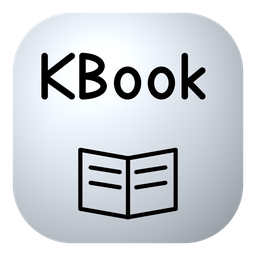
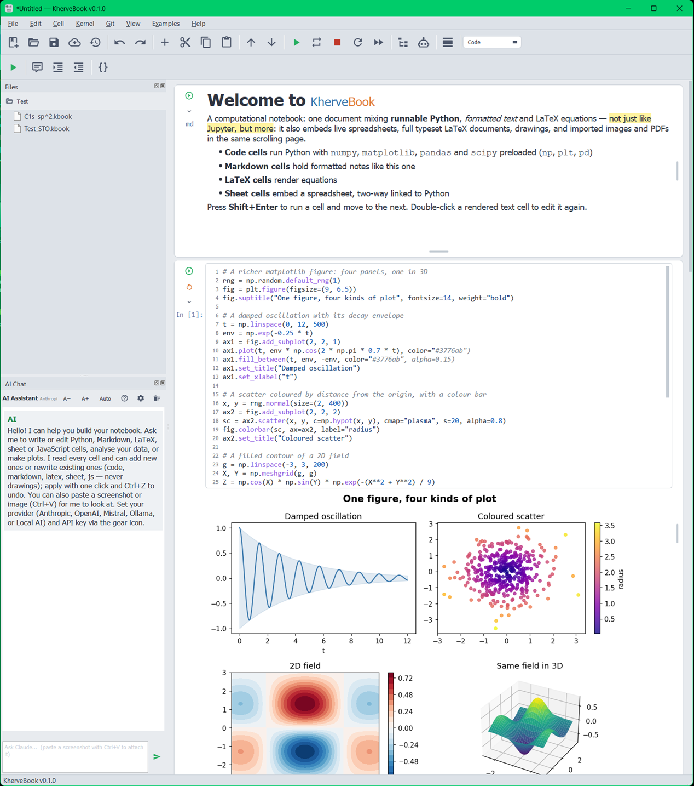
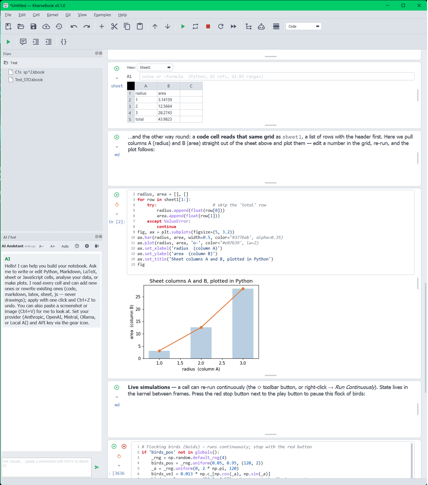
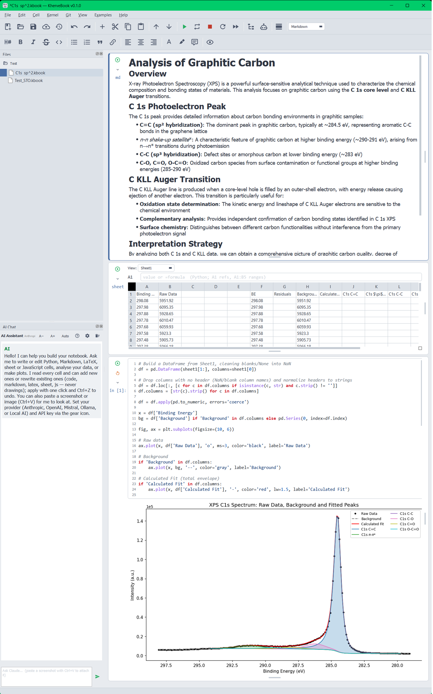

<p align="center">
  
</p>

<h1 align="center">KherveBook</h1>

<p align="center">
  A <strong>native desktop computational notebook</strong> — one document mixes
  runnable Python, formatted text, LaTeX, live spreadsheets, drawings and more.
</p>

<p align="center">
  Built with Python, PyQt5 and matplotlib. Part of the Kherve software family
  (KherveFitting, KherveSheet, KhervePaint/KherveScribe, KhervePDF, KherveDOC).
</p>



KherveBook is **Jupyter-inspired**, but it is **not Jupyter and not Marimo**,
and there is **no browser inside it**: it is a genuine native application that
renders every cell with Qt widgets and runs Python in its own in-process
kernel.

## Six kinds of cell in one scrolling document

- **Code** — Python in a shared kernel (`numpy`, `matplotlib`, `pandas`,
  `scipy`, `sympy`, `dask` preloaded), `In [n]:` counters, stdout/stderr
  capture, Jupyter-style echo of the trailing expression, inline **or**
  interactive figures, line numbers, and rich syntax highlighting.
- **Markdown** — formatted notes; double-click a rendered cell to edit.
- **LaTeX** — full typeset documents via the `tectonic` engine, or equations
  via matplotlib mathtext when tectonic isn't installed.
- **Sheet** — an embedded multi-sheet spreadsheet with `=` formulas (Python +
  Excel-style functions, A1 refs and ranges), **two-way linked to Python**
  (read the grid as `sheet1` in code cells; `ks("A1", value)` writes back),
  with charts.
- **SVG drawing** — sketch with pen / line / rect / ellipse / text tools, or
  hand off to **KherveScribe** for the full vector toolset and reload on save.
- **JavaScript / HTML** — D3, Plotly, canvas or three.js in an embedded web
  view.

## Sheet ↔ Python, both ways



A spreadsheet cell computes its `=` formulas and publishes itself to code cells
as `sheet1`; a code cell reads that grid and plots it. Edit a number, re-run,
and the plot follows. Cells can also run **continuously** for live simulations.

## Real analysis, not just demos



A markdown write-up, a data sheet, and a Python cell that builds a DataFrame
from the grid and plots a fitted XPS C 1s spectrum — prose, spreadsheet and
code living in one document.

## More than a notebook

- **~180 built-in examples** — Math, Physics, Chemistry, Biology, Materials,
  Signal Processing, Statistics, Finance, Data, Simulations, plus full
  materials-characterisation technique sets: **ARPES, XPS, XRD, EDX, EELS,
  TGA, BET, SIMS, NMR, FTIR**. Each references the real Python library for
  that technique (peaks, lmfitxps, pyGAPS, HyperSpy/eXSpy, nmrglue, pymatgen,
  spectrochempy, …) and falls back to faithful synthetic data so every example
  runs offline.
- **AI assistant** — a chat that reads every cell and can add or rewrite cells
  for you (Claude, ChatGPT, Mistral, Ollama or a local model); paste a
  screenshot to ask about it.
- **Per-notebook Git** — each `.kbook`'s folder is its own repository:
  auto-commit on save, a painted history graph, branch / diff / restore, and
  push / pull to GitHub or GitLab.
- **Import / export** — Jupyter/Colab `.ipynb` (lossless round-trip),
  `.ksheet` / `.kdoc` / `.ktex`, `.xlsx` / `.xlsm`, and images / PDFs (as SVG
  cells).
- **And**: undo/redo, a dockable file explorer, light/dark themes,
  find-in-cell, a thesaurus for prose, interactive matplotlib toolbars, and a
  detailed in-app User Guide.

## Install & run

```sh
pip install -r requirements.txt
python KherveBook.py          # or:  python -m khervebook
```

`Shift+Enter` runs the current cell and moves to the next. Documents are saved
as `.kbook` (JSON). Full LaTeX cells need the [`tectonic`](https://tectonic-typesetting.github.io/)
binary + PyMuPDF; without them, LaTeX falls back to a lightweight renderer.

**Windows packaging** — a one-folder PyInstaller build plus an NSIS installer
and a portable zip live in `packaging/` (see [CLAUDE.md](CLAUDE.md)).

## How it differs from Jupyter and Marimo

|                         | Jupyter          | Marimo                | KherveBook                                   |
| ----------------------- | ---------------- | --------------------- | -------------------------------------------- |
| Interface               | Browser          | Browser               | **Native Qt desktop app**                    |
| Engine                  | IPython kernel   | Marimo reactive runtime | **Its own in-process kernel**              |
| Cell types beyond code/text | —            | —                     | **Sheet, SVG drawing, LaTeX-doc, JS**        |
| Built in                | ecosystem        | reactive, `.py` files | **AI, per-notebook Git, ~180 sci examples**  |

KherveBook shares the *cell-based notebook* idea with both, but none of their
code — no browser, no Marimo engine. (Marimo-style reactive execution is on
the roadmap.)

## License

GPL-3.0 — see [LICENSE](LICENSE).
